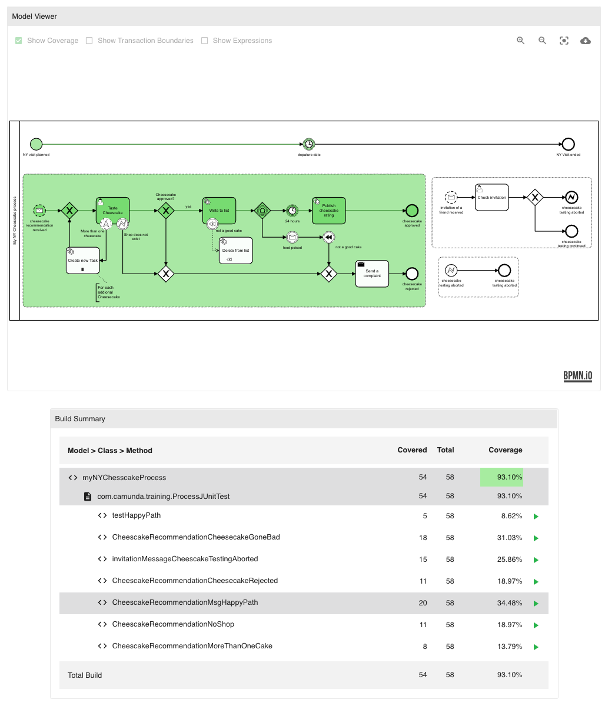

<p align="center">
    :fire: &nbsp; <b>Read our product announcement on the <a href="https://camunda.com/blog/2020/09/traceable-test-coverage-for-all-process-stakeholders/">Official Camunda Blog</a>!</b>
</p>

<br />

<p align="center">
  
</p>

<h3 align="center">FlowCov Camunda Testing Rule</h3>
  
<p align="center">
  Improve your workflow and decision models by testing them just as you test your code. 
  <br />
  Using this testing library you can generate test coverage reports as part of your regular build<br />
  that you can upload to <b><a href="https://flowcov.io">FlowCov.io</a></b> to create a beautiful coverage dashboard for your project.
  <br />
  <br />
  <a href="https://app.flowcov.io"><b>Open the App »</b></a>
  &nbsp;&nbsp;&nbsp;&nbsp;&nbsp;&nbsp;&nbsp;&nbsp;
  <a href="https://docs.flowcov.io"><b>Explore the Docs »</b></a>
  &nbsp;&nbsp;&nbsp;&nbsp;&nbsp;&nbsp;&nbsp;&nbsp;
  <a href="https://github.com/FlowSquad/flowcov-camunda/issues"><b>Report Bug »</b></a>
</p>

<br />
<br />

<p align="center">
    
</p>

<br />
<br />

---

<h4 align="center">:warning: FlowCov is still in beta and subject to change!</h4>
<p align="center">
  We reserve the right to perform a reset until the end of the beta phase in which case all data will be lost.
  <br /> 
  We will announce this at least one week in advance.
</p>

---

<br />

<h3 align="center">Table of Contents</h3>
<p align="center">
  <a href="#introduction">Introduction</a>
  ·
  <a href="#getting-started">Getting Started</a>
  ·
  <a href="#roadmap">Roadmap</a>
  ·
  <a href="#feedback">Feedback</a>
  ·
  <a href="#contributing">Contributing</a>
  ·
  <a href="#license">License</a>
</p>

<br />

## Introduction

Code Coverage has been established as a reliable indicator for code quality over the last few years. However, this does not only apply to testing source code. If you're using BPMN to model and automate your business processes, you should write appropriate tests for these as well. 

How can you measure your test coverage in BPMN? Camunda has been providing the test coverage library `camunda-bpm-process-test-coverage` to solve this issue. It has been around for quite some time and enables you to display your processes and highlight the parts of it that were covered by your tests.

However, there are still a lot of features you are going to miss when using it in your build pipelines to ship BPMN and DMN into production. That's why we created FlowCov to overcome these limitations and enable you to use workflow test coverage as an indicator for the quality of your processes. 

**These are some reasons why you should use it within your pipelines:**

- :white_check_mark: &nbsp; **Full support for BPMN and DMN test coverage**
- :white_check_mark: &nbsp; **Central storage and archival for all coverage reports**
- :white_check_mark: &nbsp; **Ability to replay unit tests to understand the token flow**
- :white_check_mark: &nbsp; **Visualization of coverage at class and method level**
- :white_check_mark: &nbsp; **Display of changes in workflow coverage over time**
- :white_check_mark: &nbsp; **Available for free in the FlowCov cloud**
- :white_check_mark: &nbsp; **On-Premise hosting available**

<br />

> We'd also like to thank the creators of [Camunda BPM Process Test Coverage](https://github.com/camunda/camunda-bpm-process-test-coverage), which we took as an example for the coverage data generation.

## Getting Started

You can find a detailed Getting Started Guide in our <a href="https://docs.flowcov.io">documentation</a>:
- <a href="https://docs.flowcov.io/getting-started/creating-reports">Creating Coverage Reports</a>
- <a href="https://docs.flowcov.io/getting-started/uploading-reports">Uploading Coverage Reports to FlowCov.io</a>
- <a href="https://docs.flowcov.io/pipeline-integration/general">Coverage Report Generation as part of CI/CD Pipelines</a>
- <a href="https://docs.flowcov.io/pipeline-integration/github-actions">Coverage Report Generation with GitHub Actions</a>

## Roadmap

We are continuously working on improving FlowCov. We will add more features over time and consider the feedback of the community while updating our product. Currently, there are several additional features planned:

- **Incident Support**: See incidents that were created in your tests, inspect the stacktrace, and jump into the source code where the error occurred. 
- **Custom Dashboards**: Create and customize your dashboard to always have the information you need at hand. Use graphs to visualize trends and set up alerts to always be up-to-date.
- **Notifications**: Get notified via mail, Slack message, or webhook whenever new builds are available, your test coverage has changed or alerts are triggered.
- **Build Checks**: Automatically check if certain conditions such as minimum test coverage are met during build and use the result within your pipeline.
- **Local Coverage Viewer**: See your test coverage for local builds without uploading your reports. We will release this as open source software.
- **Variables in Test Replays**: See how your process variables change with each step in your test cases to better understand how your workflow behaves and why.
- **Support for Call Activities**: Click on Call Activities to see the nested process and its coverage.

## Feedback

Make sure to send us your feedback and ideas as we rely on you to improve FlowCov and add new features to it. We are also happy to help if you have any questions.

**How to reach us:**

- Slack: [Join our Slack Channel](https://join.slack.com/t/flowcov/shared_invite/zt-gyh1d6d1-esd4cAZJnLuFObsiH7OCNA)
- Mail: contact@flowsquad.io
- Twitter: [@flowsquad_io](https://twitter.com/flowsquad_io)

You can also create issues in our public GitHub projects, depending on what part of FlowCov is affected:
- [FlowCov Bash Upload Script](https://github.com/FlowSquad/flowcov-bash)
- [FlowCov Camunda Test Rule](https://github.com/FlowSquad/flowcov-camunda)
- [FlowCov Camunda Examples](https://github.com/FlowSquad/flowcov-camunda-examples)

## Contributing

We are always welcoming new contributors that are helping to make FlowCov the best tool for workflow coverage management. 

The [Open Source Guides](https://opensource.guide/) website has a lot of information for people and companies who are interested in how to run and contribute to an open source project. Contributors and people new to open source will find [this guide on how to contribute to Open Source](https://opensource.guide/how-to-contribute/) especially helpful.

There are many ways in which you can contribute to FlowCov, and not all of them require you to write code:

- **Use FlowCov!** Test our features, check if edge cases are breaking them, and open issues if anything does not work as expected or could be improved. Send us your feedback.
- **Read our documentation.** Is everything covered or are there any missing parts? Are the guides accurate and easy to follow? Open an issue if anything is missing or wrong.
- **Check our open issues.** If there is any issue you would like to work on, feel free to fork the repository and submit a pull request. If you need help, let us know, we're here to help.

## License

Distributed under the Apache 2.0 License.

```
  Copyright 2020 FlowSquad GmbH
  
  Licensed under the Apache License, Version 2.0 (the "License");
  you may not use this file except in compliance with the License.
  You may obtain a copy of the License at
  
  http://www.apache.org/licenses/LICENSE-2.0
  
  Unless required by applicable law or agreed to in writing, software
  distributed under the License is distributed on an "AS IS" BASIS,
  WITHOUT WARRANTIES OR CONDITIONS OF ANY KIND, either express or implied.
  See the License for the specific language governing permissions and
  limitations under the License.
```